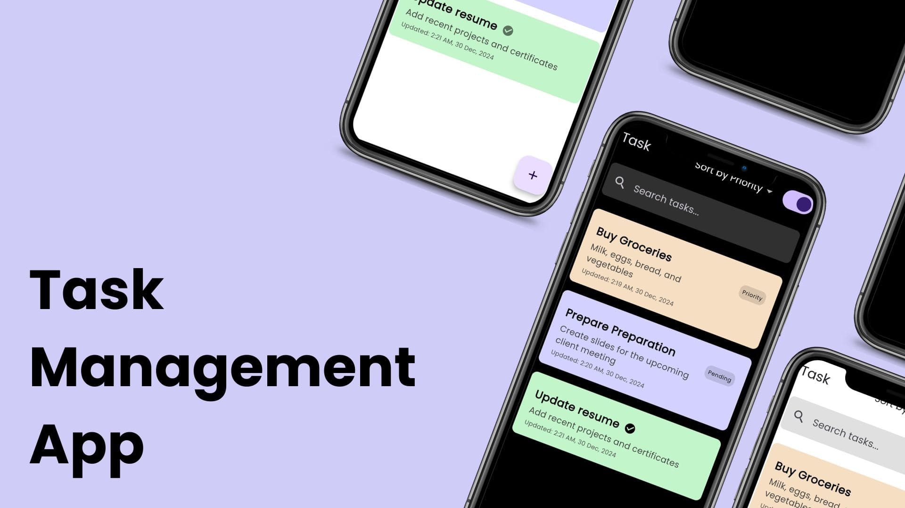
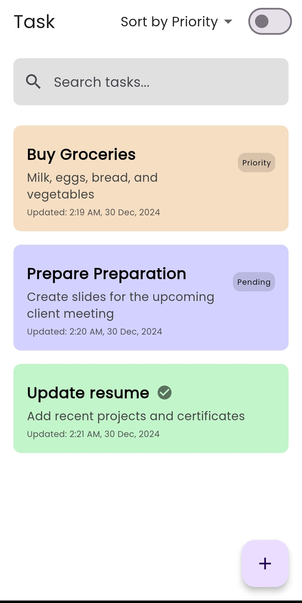
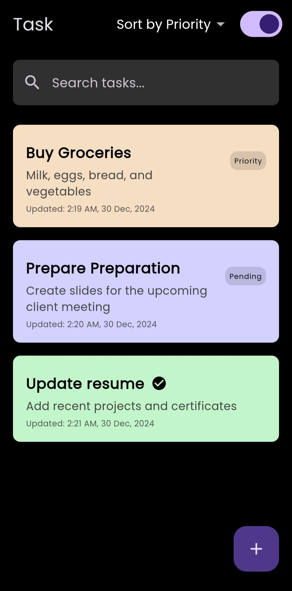

# flutter-task-management-app
This Flutter app allows users to efficiently manage tasks using a modern MVVM architecture, Riverpod for state management, and local storage solutions with SQLite and Hive. The app features a clean and responsive UI that adapts seamlessly across mobile and tablet devices, ensuring an optimal user experience on all screen sizes.

## Features
- **Task Management**: Add, edit, delete, and view tasks. Mark tasks as completed or pending.
- **Data Storage**: 
  - **SQLite** for task data.
  - **Hive** for user preferences (theme and sort order).
- **State Management**: Riverpod to manage state for tasks and preferences.
- **Responsive UI**: Adapts to both mobile and tablet screens.
- **Additional Features**:
  - **Search and Filter**: Easily search and filter tasks based on criteria like name, description.
  - **Local Notifications**: Receive reminders for tasks via local notifications.

## Technical Stack
- **Flutter**: Dart-based UI framework.
- **Riverpod**: State management solution.
- **SQLite**: Local database for task storage.
- **Hive**: NoSQL database for user preferences.

## Getting Started
1. Clone the repository:
   ```bash
   git clone https://github.com/yourusername/flutter-task-management-app.git
   ```
2. Navigate to the project directory:
   ```bash
   cd flutter-task-management-app
   ```
3. Install the dependencies:
   ```bash
   flutter pub get
   ```
4. Run the app:
   ```bash
   flutter run
   ```

## Architecture
- **Model**: Task and UserPreference models.
- **ViewModel**: Business logic and state management.
- **View**: Flutter UI components for task listing and management.

## Screenshots

### Home Screen





